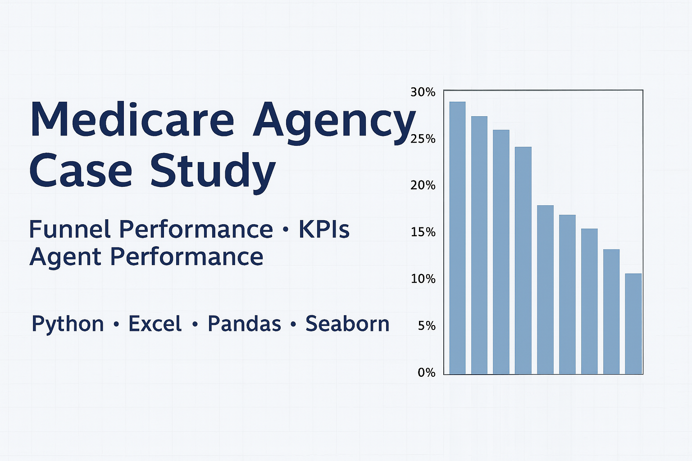

# Funnel KPI Case Study (Fictional Data)


This project's dataset is simulated real-world insurance sales activity, and the goal was to analyze agent performance, sales pipeline velocity, and quota alignment.

---
> ⚠️ **Note:** All data is fictional. No proprietary or real client data is included.

---

## Key Definitions

To align with the project's terminology and scope, the following definitions guided the analysis:

- **Agent**: Licensed insurance representative authorized to engage potential customers and submit policy applications.
- **Agent Ramp**: Experience level, progressing from ramp_0 to ramp_3, with tenured agents representing the most experienced.
- **Quota**: Monthly sales expectations by product and experience level.
- **Lead**: A prospective customer who inquired online about Medicare coverage.
- **Contact**: An attempt by an agent to reach a lead to discuss options.
- **Quote**: A price estimate provided by the agent for a specific Medicare product.
- **Application**: A completed policy application submitted to a carrier on the customer’s behalf.

---

## Instructions from Prompt

This project was guided by the following objectives:

- Generate reports to showcase trends in the dataset
- Develop KPIs to evaluate sales performance
- Provide clear, stakeholder-ready analysis
- Address core questions such as:
  1. What is the most important KPI, and why?
  2. Who are the top performers and what factors explain their success?
  3. Are some leads higher quality than others?
  4. What strategies could increase production?

---

## Project Overview

The analysis focused on extracting actionable insights from five interrelated datasets:

- **Agent profiles**
- **Product quotas by ramp stage**
- **Lead contact logs**
- **Quotes**
- **Applications**

Key metrics and KPIs included:

- **Funnel metrics**: Contact, quote, and application rates overall and by agent
- **Velocity metrics**: Sales funnel velocity (lead-to-contact, contact-to-quote, and quote-to-app timing)
- **Quota alignment**: Agent performance measured by conversion rate vs quota by product and tenure
- **Top Agent Analysis**: Conversion rate comparisons between top agents and the broader team
- **Opportunity areas**: Low contact rate (~7%) was a primary bottleneck; further investigation of lead quality recommended

---

## Tools Used

- **Python (pandas, matplotlib, seaborn, scipy.stats.pearsonr for correlation analysis)**
- **Jupyter Notebook** for analysis and visual exploration
- **Excel** for initial exploration and pivot analysis

---

## Key Insights

- Top 5 agents contributed a disproportionately high % of applications, especially in Medicare Supplement sales
- Velocity metrics suggested that faster agent response times **did not always** lead to higher conversion rates
- Overall funnel efficiency was low (1% conversion from leads → apps), with a major drop-off at the **contact** stage
- Additional opportunity identified in evaluating **lead source quality**

---

## 📁 Repo Structure

```md
Funnel-KPI-Case-Study/
├── README.md
├── LICENSE
├── Medicare_Funnel_Analysis.ipynb # Main analysis notebook
├── docs
│   └── data_structure.md # Summary of dataset schema
├── environment.yml
└── figures
    ├── conversion_by_agent_effectiveness.png
    ├── coor_quotes_to_app.png
    ├── funnel_kpi_by_agent.png
    ├── org_funnel_summary.png
    ├── quotes_apps_top5_agents_vs_team.png
    ├── total_apps_vs_tenure_agent.png
    └── velocity_metrics_agent.png
```

---

## Next Steps

If expanded further, this project could include:

- Automated data pipeline for monthly KPI refresh
- Interactive dashboard for agent performance tracking
- Lead scoring model to prioritize high-quality leads
- Statistical correlation analysis (e.g., using `scipy.stats.pearsonr`) to assess relationships between quote behavior (quote rate, timing, frequency, mix and conversion), funnel velocity, and application success
- Deeper exploration of whether faster contact or quoting correlates with improved conversion rates
